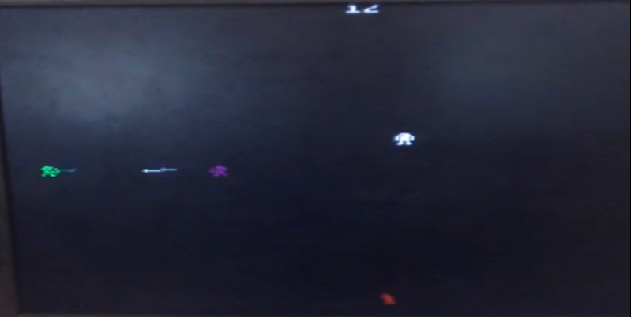

# TheLegendOfLink

OVERVIEW
--------------------------------------------------
The purpose of this project was to implement a retro game in VHDL (VHSIC Hardware Description Language) following FSM (Finite State Machine) concepts along with a FPGA for the [Digital Systems] course. It was made at the Computer Science undergraduate program from University of São Paulo (ICMC - USP).

THE GAME
--------------------------------------------------
The game is similar to an Atari 2600 VCS game, basically it is a Horizontal Shoot-em-up game where you control a character by moving it vertically and you have to shoot the enemies.
There are 3 types of enemies which the main difference is the speed they move, but there is one of them that can warp himself through the screen.



HOW TO COMPILE
--------------------------------------------------
The game was made using Quartus software along with an Altera Cyclone II DE2-70 FPGA.

```bash
	1. Install Quartus software.
	2. At the end of Quartus configuration wizard, select Altera Cyclone II DE2-70 FPGA.
	3. Open the file AP9.qpf and compile the project.
```

COMMAND LIST
--------------------------------------------------
```bash
	W: up
	S: down
	SPACE BAR: shoot arrows
```

MORE INFO
--------------------------------------------------
* Please check the file `project report.pdf` to view the code and know more about this project.
